# Reel Taste — Personalized Movie Discovery Platform

**Reel Taste** is a personalized movie discovery application that builds a unique taste profile based on your interactions. It curates, scores, and ranks trending films against your preferred genres and streaming services, providing a seamless way to find your next favorite watch.

The repository is structured as a **Yarn Monorepo** containing a Next.js web application (which acts as the API proxy and desktop interface) and an Expo React Native mobile application.

---

## 📐 Project Architecture

```mermaid
graph TD
    subgraph apps/mobile [Mobile App - Expo]
        RN[React Native UI] -->|relative fetches| FC[Custom Fetch Client]
        FC -->|API requests| AP[Next.js API Proxy]
        RN -->|Cache Local State| AS[AsyncStorage]
    end

    subgraph apps/web [Web App - Next.js]
        WA[Next.js Frontend] -->|Cache Local State| LS[window.localStorage]
        WA -->|Internal fetches| AP
        AP -->|Bearer Token & Key| TMDB[The Movie Database API]
    end
    
    style apps/mobile fill:#0d2a2a,stroke:#2dd4bf,stroke-width:2px;
    style apps/web fill:#0a1628,stroke:#3b82f6,stroke-width:2px;
```



### Component Breakdown
1. **Next.js Web App (`apps/web`):** Direct host of user preferences and custom API routes (`/api/movies/*`) which serve as an authorization and normalization proxy for the TMDB API.
2. **Expo Mobile App (`apps/mobile`):** Universal client designed for iOS, Android, and mobile web. It routes all endpoint calls dynamically to the Next.js API server.

---

## 📂 Folder Structure

```
├── apps/
│   ├── mobile/                 # React Native / Expo Mobile App
│   │   ├── src/
│   │   │   ├── app/            # Expo Router Tabs & Detail Stack
│   │   │   ├── components/     # UI layouts
│   │   │   └── utils/          # Preferences, Watchlists & Fetch Helpers
│   │   ├── App.tsx             # Root Mobile Entry
│   │   ├── App.web.tsx         # Root Web Entry
│   │   └── tailwind.config.js  # Mobile tailwind styling
│   │
│   └── web/                    # Next.js Web App
│       ├── src/
│       │   ├── app/            # App Router Pages & API routes
│       │   ├── components/     # Movie Cards, Details, & Onboarding modals
│       │   └── utils/          # Taste Preference Hook & Scoring Engine
│       └── postcss.config.mjs  # Tailwind V4 Config
│
├── package.json                # Root yarn workspaces declaration
└── yarn.lock                   # Monorepo lockfile
```

---

## ✨ Features

*   **🎬 Live Data Integration:** Live trending feeds, cast details, directors, and official trailers sourced directly from TMDB.
*   **📊 Dynamic Recommendation Engine:** Every rating (👍 / 👎) re-weights genres in your local profile, automatically pushing matching films to the top of your feed.
*   **📡 Streaming Service Filtering:** Matches movies against your available subscriptions (Netflix, Prime, Disney+, Max, etc.) and gives those titles scoring bonuses.
*   **💾 Local Storage Persistence:** The entire watchlist, ratings collection, and onboarding configurations persist locally using `AsyncStorage` (Mobile) and `localStorage` (Web).
*   **✨ Premium Visuals:** Modern dark mode UI featuring responsive glassmorphic cards, smooth spring-based animations, and custom skeletons.

---

## 🛠️ Technology Stack

| Component | Stack |
| :--- | :--- |
| **Web Frontend** | Next.js 16 (App Router), Tailwind CSS v4, Lucide Icons, Radix UI / Base UI, Vitest |
| **Mobile Frontend** | Expo 54, Expo Router, React Native Reanimated, Moti (skeletons), Tailwind CSS v3 |
| **State & Fetching** | Zustand, React Query (TanStack Query) |
| **API Provider** | The Movie Database (TMDB) API |

---

## 🚀 Getting Started

### 1. Prerequisites
Ensure you have **Node.js (v18+)** and **Corepack** enabled to run Yarn v4.

```bash
corepack enable
```

### 2. Configure Environment Variables
Create a `.env` file in **`apps/web/`**:
```env
TMDB_API_KEY=your_tmdb_api_key_here
```

Create a `.env` file in **`apps/mobile/`**:
```env
EXPO_PUBLIC_BASE_URL=http://localhost:4000
```

### 3. Install Dependencies
From the root of the workspace, run:
```bash
corepack yarn install
```

### 4. Running the Development Servers

To start the Next.js API proxy and web app (runs on port `4000`):
```bash
corepack yarn workspace web dev
```

To start the Expo Metro Bundler (runs on port `8081`):
```bash
corepack yarn workspace mobile start
```
From the Expo terminal menu, you can press **`w`** to open in the browser, or scan the QR code using your Expo Go app on iOS or Android.
